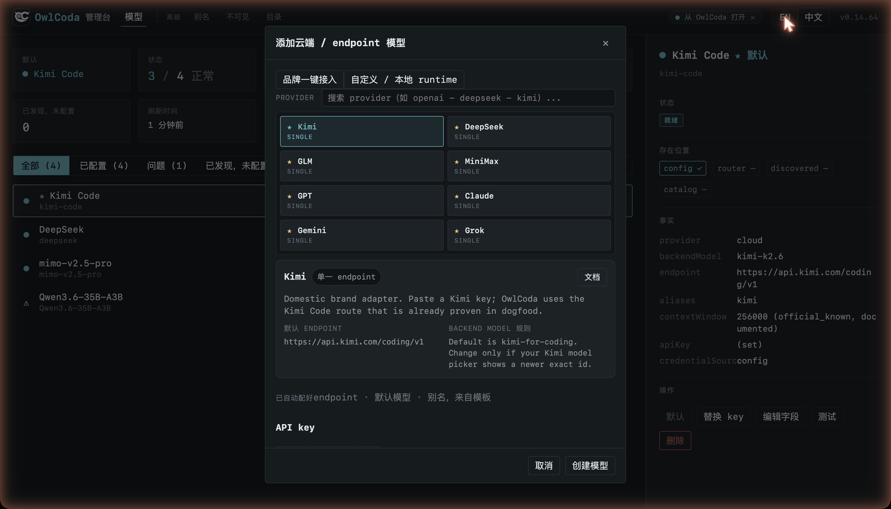

# OwlCoda

**English** · [中文](README.zh.md)

> **Your models. Your tools. Your data. Runs locally — no login, no cloud.**

OwlCoda is an independent, local-first AI coding workbench: a native terminal
REPL with 42+ tools and 69+ slash commands, session persistence, learned
skills, and production-grade middleware — all on your own machine. **Every model
you use — a cloud brand or a model on your own hardware — is wired up and
governed from one place: the browser Admin.**

**Privacy by default.** Sessions stay in `~/.owlcoda/`. There is no OwlCoda
account and no OwlCoda server. Training-data collection is opt-in (off by
default), PII-sanitized before it touches disk, and never uploaded.

## One control plane for every model

`owlcoda admin` opens a browser console where you wire up any model and OwlCoda
routes to it. Cloud brands connect in one click — Kimi, DeepSeek, GPT, Claude,
Gemini, Grok, GLM, MiniMax — with the endpoint, default model, and aliases
filled in from a template; paste a key and you're live. Anything else — a model
on your own machine or any custom OpenAI-/Anthropic-compatible endpoint — goes
through the custom lane. Routing, fallback, health, cost, and audit all sit
behind the same console.



## Install

```bash
npm install -g owlcoda@latest
owlcoda            # first run opens setup when no model is configured
owlcoda admin      # browser admin: configure a local runtime or cloud provider
```

Requirements: Node.js `>=20.19.0` (Node 22+ recommended) and one LLM backend —
a local runtime (Ollama / LM Studio / vLLM / any OpenAI-compatible endpoint) or
a cloud provider's API key.

If your global npm prefix isn't writable, use a user-level prefix:

```bash
npm config set prefix ~/.local && export PATH=~/.local/bin:$PATH
npm install -g owlcoda@latest
```

## Quickstart — owlmlx local runtime

With owlmlx already running on `:8066`, initialize OwlCoda against that runtime:

```bash
owlcoda init --endpoint http://127.0.0.1:8066
owlcoda
```

OwlCoda's committed local default is owlmlx on `http://127.0.0.1:8066`. Ollama
uses `http://127.0.0.1:11434/v1`; LM Studio uses
`http://127.0.0.1:1234/v1`; vLLM uses `http://127.0.0.1:8000/v1`. Cloud
providers are configured in `owlcoda admin`.

### Images and Kimi K2.7

Vision-capable OpenAI-compatible models can receive local images from the REPL.
Paste a local image path, insert one with `@image.png`, or use a Markdown image
reference like ``; OwlCoda sends the image as a base64
multimodal content block. Supported extensions are `png`, `jpg`/`jpeg`, `webp`,
and `gif`.

For Kimi K2.7 Code, set `MOONSHOT_API_KEY` or add the **Kimi K2.7 Code** provider
in `owlcoda admin`, then use `--model kimi27` or `--model kimi-k2.7-code`.

Don't start by asking it to rewrite a large project. In a repo you know, begin
read-only, then give it one small, clearly-scoped change:

```bash
cd your-project
owlcoda -p "Read this project and tell me the entry point, test command, and main directories. Do not modify files."
```

## What it is

OwlCoda sits between your models and your real project. The model can act, but
every action passes through a boundary, leaves an artifact, and is recorded — so
a long-running agent isn't trusted on its word alone.

- **Bring your own models.** Local runtimes and cloud providers collapse into
  one model registry with routing, fallback, retry, circuit-breaking, and
  per-model timeouts.
- **Native REPL.** 42+ tools (Bash, Read/Write/Edit, Glob, Grep, Task,
  MCP-served tools, agent dispatch) and 69+ slash commands, with session
  persistence, search, tags, and branching.
- **Learned skills.** Complex sessions are distilled into reusable skills and
  matched back into the system prompt on similar tasks. Manage them with
  `owlcoda skills`.
- **Training-data pipeline (opt-in).** Sessions can be scored, PII-sanitized,
  and exported to local JSONL for fine-tuning — off by default, local-only.
- **Browser admin & diagnostics.** `owlcoda admin` for model configuration;
  `owlcoda doctor` / `health` / `audit` / `inspect` for runtime diagnostics.

Capability labels (`supported` / `partial` / `manual-only` / `unsupported`) are
declared in [`src/capabilities.ts`](src/capabilities.ts) and kept honest against
runtime behavior.

Product truth and distribution authority live in
[`docs/PRODUCT-TRUTH.md`](https://github.com/yeemio/owlcoda/blob/main/docs/PRODUCT-TRUTH.md).

## Common commands

```bash
owlcoda                          # interactive REPL (native)
owlcoda -m fast                  # pick a model by id / alias / partial match
owlcoda -p "list all .ts files"  # headless (non-interactive)
owlcoda init                     # write config.json (auto-detects models)
owlcoda admin                    # browser admin
owlcoda doctor [--json]          # environment diagnostics; JSON includes build/schema identity
owlcoda models                   # tiered model list + route probing
owlcoda --resume last            # resume the previous session
owlcoda skills                   # list learned skills
owlcoda --help                   # full command list
```

## Configuration

`owlcoda init` writes `config.json`; see
[`config.example.json`](config.example.json) for the full shape. If a platform
`catalog.json` is reachable, models load automatically with no manual `models`
array.

```json
{
  "port": 8019,
  "routerUrl": "http://127.0.0.1:8066",
  "models": [
    {
      "id": "Qwen3.6-27B",
      "label": "Qwen3.6 27B (owlmlx)",
      "backendModel": "Qwen3.6-27B",
      "endpoint": "http://127.0.0.1:8066/v1",
      "aliases": ["balanced", "default"],
      "default": true
    }
  ]
}
```

Kimi CLI, Cursor Agent CLI, and Codex CLI can be registered explicitly as
bounded model executors for `POST /v1/structured-output`:

```json
{
  "models": [
    {
      "id": "kimi-cli",
      "label": "Kimi CLI",
      "backendModel": "kimi-code/kimi-for-coding",
      "aliases": ["kimi-cli"],
      "tier": "custom",
      "executor": { "kind": "kimi-cli", "executable": "kimi" }
    },
    {
      "id": "cursor-agent",
      "label": "Cursor Agent CLI",
      "backendModel": "auto",
      "aliases": ["cursor-agent"],
      "tier": "custom",
      "executor": { "kind": "cursor-agent", "executable": "cursor-agent" }
    },
    {
      "id": "codex-cli",
      "label": "Codex CLI",
      "backendModel": "gpt-5.6-sol",
      "aliases": ["codex-cli"],
      "tier": "custom",
      "executor": { "kind": "codex-cli", "executable": "codex" }
    }
  ]
}
```

Use model aliases available in the installed CLIs. These routes are
non-streaming, local-read-only structured-output calls; they do not expose a
general coding-agent or arbitrary command API. `GET /v1/models` reports each
configured CLI's executable, version, and authentication availability.

Selected environment variables:

| Variable | Purpose | Default |
|---|---|---|
| `OWLCODA_PORT` | Proxy listen port | `8019` |
| `OWLCODA_HOME` | Data directory | `~/.owlcoda` |
| `OWLCODA_LOG_LEVEL` | Log level | `info` |
| `OWLCODA_RENDER_MODE` | `safe` (per-line repaint, default) or `diff` | `safe` |

## Known limitations

- **Transcript scrollback** isn't wired to the mouse wheel yet under terminal
  multiplexers (tmux/screen). Use `PgUp` / `PgDn` / `Ctrl+↓` or `/history`
  inside the app.
- **Streaming cross-model fallback stops after visible output** — connection,
  5xx, and pre-first-token failures can continue on an eligible model when
  automatic fallback is enabled. Mid-stream failures stay explicit to avoid
  replaying or mixing output from different models.
- **`/cost` USD figures are a reference only** — local inference is effectively
  free; the dollar number uses cloud pricing for comparison.
- **LSP tools need a language server** you install yourself (e.g.
  `typescript-language-server`, `pyright`, `rust-analyzer`, `gopls`), wired via
  plugin config.
- **Remote OAuth MCP servers aren't supported** yet; stdio MCP servers (via
  `.mcp.json`) work.

## HTTP API

The proxy exposes an Anthropic-compatible `POST /v1/messages` and an
OpenAI-compatible `POST /v1/chat/completions`, plus `GET /v1/models`, `/metrics`
(Prometheus), `/health`, and `/openapi.json`. The full surface is reflected in
`GET /openapi.json`.

## License

From the `0.15.0` boundary, OwlCoda source is released under
**`GPL-3.0-or-later`**. Commercial, OEM, or embedded distribution uses a
separate license handled by the maintainer.

This repository is the public source, issue, release, and trust surface for GPL
releases. npm packages may ship compiled `dist/` only; see
[SOURCE.md](SOURCE.md) for the corresponding-source requirement. Historical
published versions keep the license they were published under.

## Links

- Website: [owlcoda.com](https://owlcoda.com)
- Issues & PRs: [github.com/yeemio/owlcoda/issues](https://github.com/yeemio/owlcoda/issues)
- Contributing: [CONTRIBUTING.md](CONTRIBUTING.md) · Security: [SECURITY.md](SECURITY.md)
- Demo: [World Cup predictor](demo/worldcup-predictor/README.md) — a five-role model debate (recon, vision, pro, anti, judge) orchestrated through OwlCoda

## Development

```bash
npm run dev     # tsx hot-reload
npm test        # run tests
npm run build   # TypeScript compile
```
